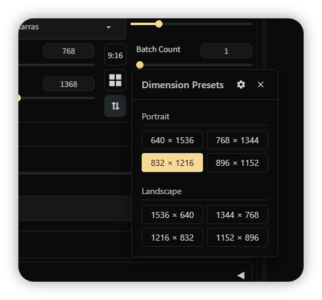

<div align="center">
    <h2>Aspect Ratio+</h2>
</div>

<div align="center">
    
</div>

A simple extension for Stable Diffusion WebUI that provides intelligent aspect ratio control and preset sizes for txt2img and img2img.

---

## Features Overview

### 🎯 Aspect Ratio Controls

**Smart Dropdown Selection**
- Adds a customizable aspect ratio dropdown that automatically scales dimensions while maintaining proportions
- Works seamlessly with both txt2img and img2img tabs
- Updates in real-time as you adjust width or height sliders

**Available Modes:**
- **Off** - Free adjustment without ratio constraints
- **Lock/🔒** - Locks the current dimensions' aspect ratio
- **Image/🖼️** - Uses the aspect ratio from the loaded image *(img2img only)*
- **Custom Ratios** - Any ratio you configure (e.g., 1:1, 16:9, 4:3, 2:3, etc.)

**Swap Button (⇅)**
- Instantly swaps width and height dimensions
- Automatically inverts aspect ratios (e.g., 16:9 becomes 9:16)
- Maintains aspect ratio lock after swapping

**Smart Constraints**
- Optional aspect ratio limiting prevents exceeding maximum dimensions (2048px)
- Automatic rounding to multiples of 8 for optimal generation
- Maintains dimensions within valid range (64-2048px)

---

### 🧩 Dimension Presets (txt2img only)

**Quick Access Popup**
- One-click button opens a floating preset selector
- Organized layout with customizable categories
- Supports 1-4 column grid layouts

**Preset Organization:**
- Use `>` prefix for category labels (e.g., `> Portrait`, `> Landscape`)
- Use `#` prefix for comments (ignored in display)
- Define presets as `width x height` (e.g., `1024 x 1024`)
- Automatic "Others" category for unlabeled presets (optional)

**Example Preset Configuration:**
```
> Portrait
640 x 1536
768 x 1344
832 x 1216

> Landscape
1536 x 640
1344 x 768

> Square
1024 x 1024
```

**Built-in Features:**
- Quick settings access button (⚙️) - jumps directly to extension settings
- Close button (×) or press ESC to dismiss
- Click outside popup to close
- Responsive positioning - adapts to screen space

---

## Configuration

Navigate to **Settings → Aspect Ratio+** to customize:

### Aspect Ratio Controls
- **Enable Aspect Ratio Controls** - Toggle the ratio dropdown on/off
- **Available Aspect Ratios** - Comma-separated list (e.g., `1:1, 2:3, 3:4, 16:9`)
- **Enforce Aspect Ratio Limits** - Prevent dimensions from exceeding 2048px when ratio is active

### Dimension Presets
- **Enable Dimension Presets Button** - Show/hide the presets button
- **Dimension Presets** - Multi-line text area for defining your preset list
- **Presets Popup Columns** - Choose 1-4 columns for preset grid layout
- **Auto-create "Others" label** - Automatically group unlabeled presets

---

## Installation

1. Navigate to your Stable Diffusion WebUI extensions folder
2. Clone this repository:
   ```bash
   git clone https://github.com/anxety-solo/sd-aspect-ratio-plus
   ```
3. Restart the WebUI or reload the UI
4. Find the controls next to the width/height sliders

---

## Credits

- **Dimension Presets** feature inspired by [sd-simple-dimension-preset](https://github.com/gutris1/sd-simple-dimension-preset) by **gutris1**